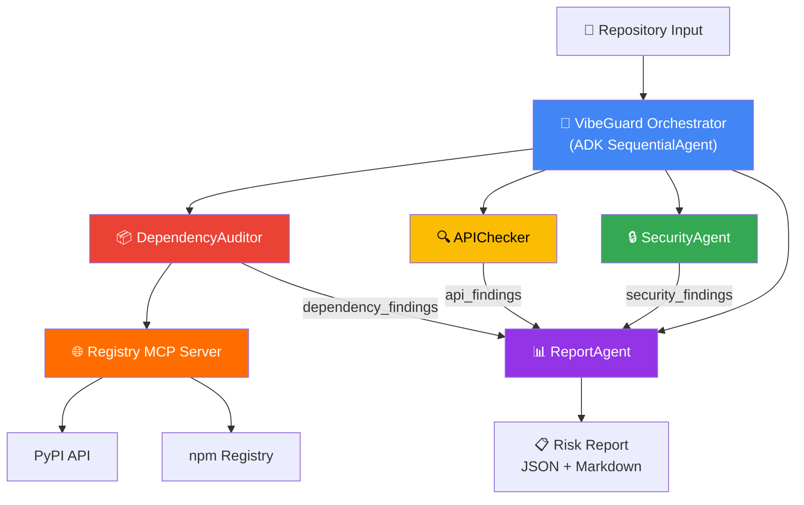

# 🛡️ VibeGuard

**Multi-Agent Security Auditor for Vibe-Coded Projects**

> AI writes code fast — but it also hallucinates packages, invents API calls, and leaves secrets in plain text. VibeGuard catches these before you ship.

[](https://www.python.org/downloads/)
[](https://google.github.io/adk-docs/)
[](https://github.com/jlowin/fastmcp)

## 🎯 The Problem

Vibe coding with AI assistants is fast, but dangerous:
- **Hallucinated packages**: LLMs invent package names that don't exist on PyPI/npm — attackers register them ([huggingface-cli case: 30K+ downloads](https://blog.lasso.security/ai-package-hallucinations-and-the-risk-of-slopsquatting/))
- **Fake API calls**: Generated code uses functions that don't exist in the imported libraries
- **Exposed secrets**: AI copies API key patterns into source code
- **Unvalidated input**: Generated endpoints skip input sanitization

## 🏗️ Architecture



### Agents

| Agent | Role | Tools |
|-------|------|-------|
| 🤖 **Orchestrator** | Coordinates all agents sequentially | ADK SequentialAgent |
| 📦 **DependencyAuditor** | Validates packages exist on PyPI/npm, detects typosquatting | Registry MCP Server |
| 🔍 **APIChecker** | Detects hallucinated function calls via AST analysis | Known API database |
| 🔒 **SecurityAgent** | Finds hardcoded secrets, SQL injection, dangerous eval | Regex + pattern matching |
| 📊 **ReportAgent** | Generates risk score (0-100) and detailed report | Aggregation |

### MCP Server

The Registry MCP Server provides 4 tools:
- `check_pypi(name)` — Verify package exists on PyPI
- `check_npm(name)` — Verify package exists on npm
- `package_age_downloads(name)` — Get package age and download stats
- `typosquat_candidates(name)` — Detect typosquatting via Levenshtein distance

## 🚀 Quick Start

### Prerequisites
- Python 3.11+
- [Google Gemini API Key](https://aistudio.google.com/apikey)

### Installation

```bash
# Clone the repository
git clone https://github.com/yourusername/vibeguard.git
cd vibeguard

# Create virtual environment
python -m venv .venv
source .venv/bin/activate  # or .venv\Scripts\activate on Windows

# Install dependencies
pip install -r requirements.txt

# Set your API key
cp .env.example .env
# Edit .env and add your GOOGLE_API_KEY
```

### Run with ADK Web UI

```bash
adk web vibeguard
```

Then open http://localhost:8000 and ask:
> "Scan the repository at ./demo/vulnerable_app for security issues"

### Run with Docker

```bash
docker build -t vibeguard .
docker run -p 8000:8000 -e GOOGLE_API_KEY=your-key vibeguard
```

## 🎪 Demo

The `demo/vulnerable_app/` directory contains an intentionally vulnerable Flask application with:

| Vulnerability | Example |
|---|---|
| 🚫 **Fake packages** | `gemini-toolkit-pro`, `langchain-helper-utils` |
| 🔀 **Typosquats** | `transformrs` (→ transformers), `cryptographic` (→ cryptography) |
| 🔑 **Hardcoded secrets** | `sk-proj-...`, `AKIA...`, passwords |
| 💉 **SQL injection** | `f"SELECT * FROM users WHERE username = '{username}'"` |
| ⚠️ **Dangerous eval** | `eval(expression)` on user input |
| 🥒 **Insecure pickle** | `pickle.loads(data)` on request body |

## 🔐 Security Design

VibeGuard treats scanned code as **untrusted input**:
- Code content is isolated in separate context blocks
- System instructions are immutable (prompt injection defense)
- No code from scanned repos is ever executed
- All analysis is static (regex + AST parsing)

## 🛣️ Future Work

- CI/CD integration (GitHub Action)
- Real-time threat intelligence feed
- IDE extension (VS Code)
- Hallucination pattern database
- Support for Go, Rust, Java ecosystems

## 📄 License

MIT
